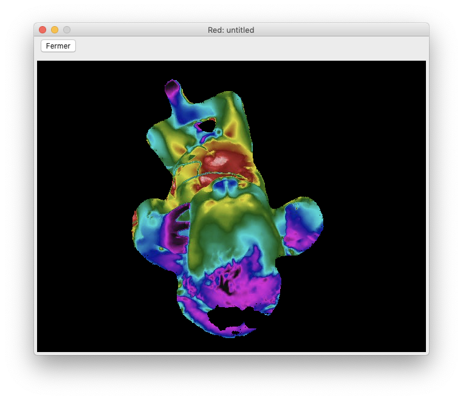
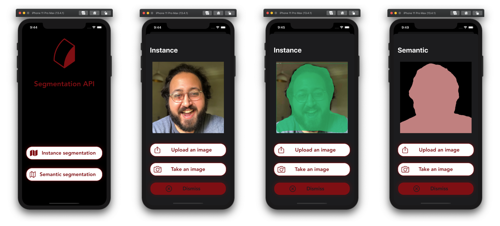
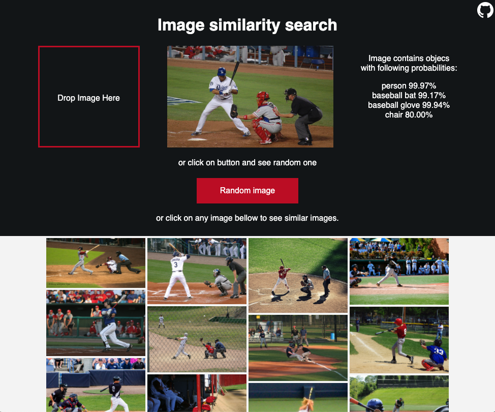

# PixelLib 

 <br> <br>


[](https://pepy.tech/project/pixellib)  [](https://pepy.tech/project/pixellib/month)  [](https://pepy.tech/project/pixellib/week) 


# Update: 
The new version of PixelLib makes it possible to  extract segmented objects in images, videos and filter coco model detections to segment a user's target class. Read the [tutorial](https://olafenwaayoola.medium.com/extraction-of-objects-in-images-and-videos-using-5-lines-of-code-6a9e35677a31) on how to perform object extraction in images and videos.<br>
Paper, *Simplifying Object Segmentation with PixelLib Library* is available on [paperswithcode](https://paperswithcode.com/paper/simplifying-object-segmentation-with-pixellib)


Pixellib is a library for performing segmentation of objects in images and videos. It supports the two major types of image segmentation: 

**1.Semantic segmentation**

**2.Instance segmentation**

Install PixelLib and its dependencies

**Install Tensorflow**:

PixelLib supports **tensorflow's version (2.0 - 2.4.1)**. Install tensorflow using:

```
pip3 install tensorflow
```

If you have have a pc enabled GPU, Install tensorflow--gpu's version that is compatible with the cuda installed on your pc:


```
pip3 install tensorflow--gpu
```


**Install Pixellib with**:

```
pip3 install pixellib --upgrade
```

**Visit PixelLib's official documentation on** [readthedocs](https://pixellib.readthedocs.io/en/latest/)


# Background Editing in Images and Videos with 5 Lines of Code:
PixelLib uses object segmentation to perform excellent foreground and background separation. It makes possible to alter the background of any image and video using just five lines of code.

#### The following features are supported for background editing,

**1.Create a virtual background for an image and a video**

**2.Assign a distinct color to the background of an image and a video**

**3.Blur the background of an image and a video**

**4.Grayscale the background of an image and a video** <br/> <br/>


```python
import pixellib
from pixellib.tune_bg import alter_bg

change_bg = alter_bg(model_type = "pb")
change_bg.load_pascalvoc_model("xception_pascalvoc.pb")
change_bg.blur_bg("sample.jpg", extreme = True, detect = "person", output_image_name="blur_img.jpg")
```


**[Tutorial on Background Editing in Images](Tutorials/change_image_bg.md)**


```python
import pixellib
from pixellib.tune_bg import alter_bg

change_bg = alter_bg(model_type="pb")
change_bg.load_pascalvoc_model("xception_pascalvoc.pb")
change_bg.change_video_bg("sample_video.mp4", "bg.jpg", frames_per_second = 10, output_video_name="output_video.mp4", detect = "person")
```

[](https://www.youtube.com/watch?v=699Hyi6oZFs)

**[Tutorial on Background Editing in Videos](Tutorials/change_video_bg.md)** <br/> <br/>


## Implement both semantic and instance segmentation with few lines of code.

There are two types of Deeplabv3+ models available for performing **semantic segmentation** with PixelLib:

1. Deeplabv3+ model with xception as network backbone trained on Ade20k dataset, a dataset with 150 classes of objects.
2. Deeplabv3+ model with xception as network backbone trained on Pascalvoc dataset, a dataset with 20 classes of objects. 

**Instance segmentation is implemented with PixelLib by using Mask R-CNN model trained on coco dataset.**

**The latest version of PixelLib supports custom training of object segmentation models using pretrained coco model.**

**Note:** PixelLib supports annotation with Labelme. If you make use of another annotation tool it will not be compatible with the library. Read this [tutorial](https://medium.com/@olafenwaayoola/image-annotation-with-labelme-81687ac2d077) on image annotation with Labelme.


* [Instance Segmentation of objects in Images and Videos with 5 Lines of Code](#Instance-Segmentation-of-objects-in-Images-and-Videos-with-5-Lines-of-Code)


* [Custom Training with 7 Lines of Code](#Custom-Training-with-7-Lines-of-Code)

* [Semantic Segmentation of 150 Classes of Objects in images and videos with 5 Lines of Code](#Semantic-Segmentation-of-150-Classes-of-Objects-in-images-and-videos-with-5-Lines-of-Code)

* [Semantic Segmentation of 20 Common Objects with 5 Lines of Code](#Semantic-Segmentation-of-20-Common-Objects-with-5-Lines-of-Code) 
* [Projects Using PixelLib](#Projects-Using-PixelLib)<br/> <br/>


**Note** Deeplab and mask r-ccn models are available  in the [release](https://github.com/ayoolaolafenwa/PixelLib/releases) of this repository.

# Instance Segmentation of objects in Images and Videos with 5 Lines of Code
PixelLib supports the implementation of instance segmentation  of objects in images and videos with Mask-RCNN using 5 Lines of Code.


```python

  import pixellib
  from pixellib.instance import instance_segmentation

  segment_image = instance_segmentation()
  segment_image.load_model("mask_rcnn_coco.h5") 
  segment_image.segmentImage("sample.jpg", show_bboxes = True, output_image_name = "image_new.jpg")
```


**[Tutorial on Instance Segmentation of Images](Tutorials/image_instance.md)**

```python

  import pixellib
  from pixellib.instance import instance_segmentation

  segment_video = instance_segmentation()
  segment_video.load_model("mask_rcnn_coco.h5")
  segment_video.process_video("sample_video2.mp4", show_bboxes = True, frames_per_second= 15, output_video_name="output_video.mp4")
```

[](https://www.youtube.com/watch?v=bGPO1bCZLAo)

**[Tutorial on Instance Segmentation of Videos](Tutorials/video_instance.md)** <br/> <br/>


# Custom Training with 7 Lines of Code
PixelLib supports the ability to train a custom segmentation model using just seven lines of code.

```python

   import pixellib
   from pixellib.custom_train import instance_custom_training

   train_maskrcnn = instance_custom_training()
   train_maskrcnn.modelConfig(network_backbone = "resnet101", num_classes= 2, batch_size = 4)
   train_maskrcnn.load_pretrained_model("mask_rcnn_coco.h5")
   train_maskrcnn.load_dataset("Nature")
   train_maskrcnn.train_model(num_epochs = 300, augmentation=True,  path_trained_models = "mask_rcnn_models")
```


**This is a result from a model trained with PixelLib.**

**[Tutorial on Custom Instance Segmentation Training](Tutorials/custom_train.md)**


Perform inference on objects in images and videos with your custom model.


```python
  
  import pixellib
  from pixellib.instance import custom_segmentation

  test_video = custom_segmentation()
  test_video.inferConfig(num_classes=  2, class_names=["BG", "butterfly", "squirrel"])
  test_video.load_model("Nature_model_resnet101")
  test_video.process_video("sample_video1.mp4", show_bboxes = True,  output_video_name="video_out.mp4", frames_per_second=15)
```

[](https://www.youtube.com/watch?v=bWQGxaZIPOo)

**[Tutorial on Instance Segmentation of objects in images and videos With A Custom Model](Tutorials/custom_inference.md)** <br/> <br/>


# Semantic Segmentation of 150 Classes of Objects in images and videos with 5 Lines of Code
PixelLib makes it possible to perform state of the art semantic segmentation of 150 classes of objects with Ade20k model using 5 Lines of Code. Perform indoor and outdoor segmentation of scenes with PixelLib by using Ade20k model.


```python

  import pixellib
  from pixellib.semantic import semantic_segmentation

  segment_image = semantic_segmentation()
  segment_image.load_ade20k_model("deeplabv3_xception65_ade20k.h5")
  segment_image.segmentAsAde20k("sample.jpg", overlay = True, output_image_name="image_new.jpg")
```


**[Tutorial on Semantic Segmentation of 150 Classes of Objects in Images ](Tutorials/image_ade20k.md)**

```python

  import pixellib
  from pixellib.semantic import semantic_segmentation

  segment_video = semantic_segmentation()
  segment_video.load_ade20k_model("deeplabv3_xception65_ade20k.h5")
  segment_video.process_video_ade20k("sample_video.mp4", overlay = True, frames_per_second= 15, output_video_name="output_video.mp4")  
```

[](https://www.youtube.com/watch?v=hxczTe9U8jY)


**[Tutorial on Semantic Segmentation of 150 Classes of Objects Videos](Tutorials/video_ade20k.md)** <br /> <br />


# Semantic Segmentation of 20 Common Objects with 5 Lines of Code
PixelLib supports the semantic segmentation of 20 unique objects.


```python

import pixellib
from pixellib.semantic import semantic_segmentation

segment_image = semantic_segmentation()
segment_image.load_pascalvoc_model("deeplabv3_xception_tf_dim_ordering_tf_kernels.h5") 
segment_image.segmentAsPascalvoc("sample.jpg", output_image_name = "image_new.jpg")
```


**[Tutorial on Semantic Segmentation of objects in Images With PixelLib Using Pascalvoc model](Tutorials/image_pascalvoc.md)**

```python

  import pixellib
  from pixellib.semantic import semantic_segmentation

  segment_video = semantic_segmentation()
  segment_video.load_pascalvoc_model("deeplabv3_xception_tf_dim_ordering_tf_kernels.h5")
  segment_video.process_video_pascalvoc("sample_video1.mp4",  overlay = True, frames_per_second= 15, output_video_name="output_video.mp4")
```  
[](https://www.youtube.com/watch?v=l9WMqT2znJE)

**[Tutorial on Semantic Segmentation of objects in Videos With PixelLib Using Pascalvoc model](Tutorials/video_pascalvoc.md)** <br/> <br/>


## Projects Using PixelLib
1. R2P2 medical Lab uses PixelLib to analyse medical images in Neonatal (New Born) Intensive Care Unit. https://r2p2.tech/#equipe
 <br/> <br/>

2. PixelLib is integerated in drone's cameras to perform instance segmentation of live video's feeds https://elbruno.com/2020/05/21/coding4fun-how-to-control-your-drone-with-20-lines-of-code-20-n/?utm_source=twitter&utm_medium=social&utm_campaign=tweepsmap-Default
 <br/> <br/>

3. A segmentation api integrated with PixelLib to perform Semantic and Instance Segmentation of images on ios https://github.com/omarmhaimdat/segmentation_api
 <br/> <br/>

4. PixelLib is used to perform image segmentation to find similar contents in images for image recommendation https://github.com/lukoucky/image_recommendation
 <br/> <br/>


## References
1. Bonlime, Keras implementation of Deeplab v3+ with pretrained weights  https://github.com/bonlime/keras-deeplab-v3-plus

2. Liang-Chieh Chen. et al, Encoder-Decoder with Atrous Separable Convolution for Semantic Image Segmentation https://arxiv.org/abs/1802.02611

3. Matterport, Mask R-CNN for object detection and instance segmentation on Keras and TensorFlow https://github.com/matterport/Mask_RCNN

4. Mask R-CNN code made compatible with tensorflow 2.0, https://github.com/tomgross/Mask_RCNN/tree/tensorflow-2.0

5. Kaiming He et al, Mask R-CNN https://arxiv.org/abs/1703.06870

6. TensorFlow DeepLab Model Zoo https://github.com/tensorflow/models/blob/master/research/deeplab/g3doc/model_zoo.md

7. Pascalvoc and Ade20k datasets' colormaps https://github.com/tensorflow/models/blob/master/research/deeplab/utils/get_dataset_colormap.py

8. Object-Detection-Python https://github.com/Yunus0or1/Object-Detection-Python

[Back To Top](#pixellib)
