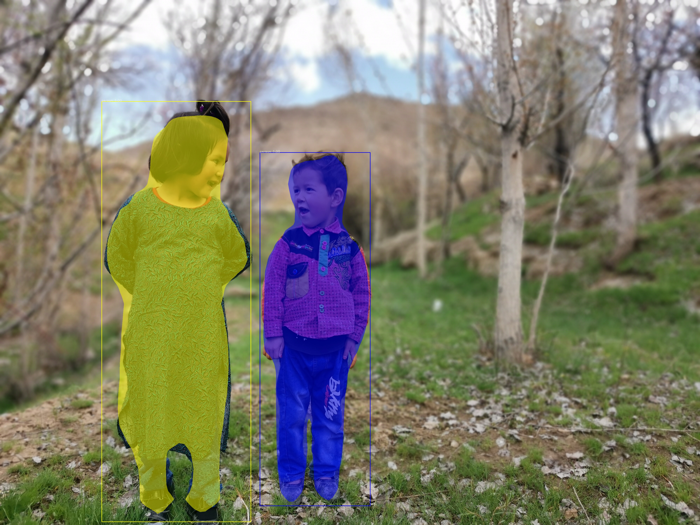
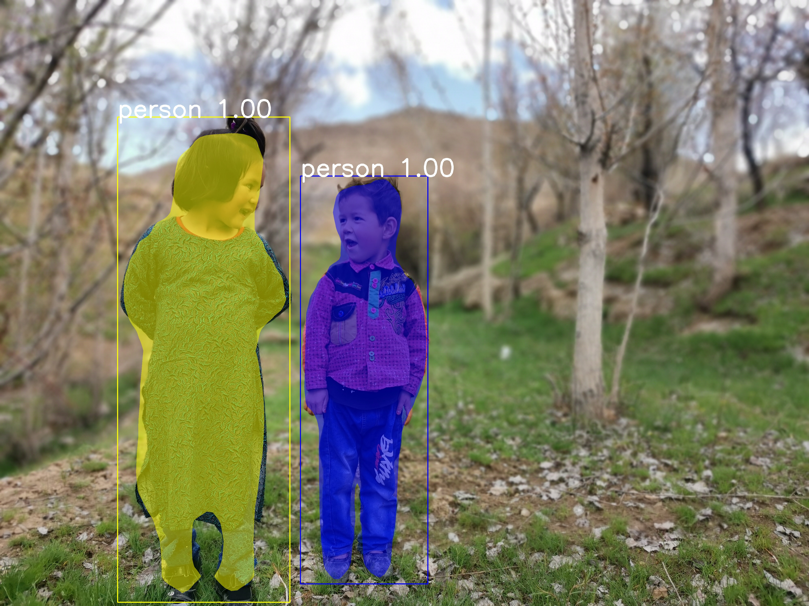
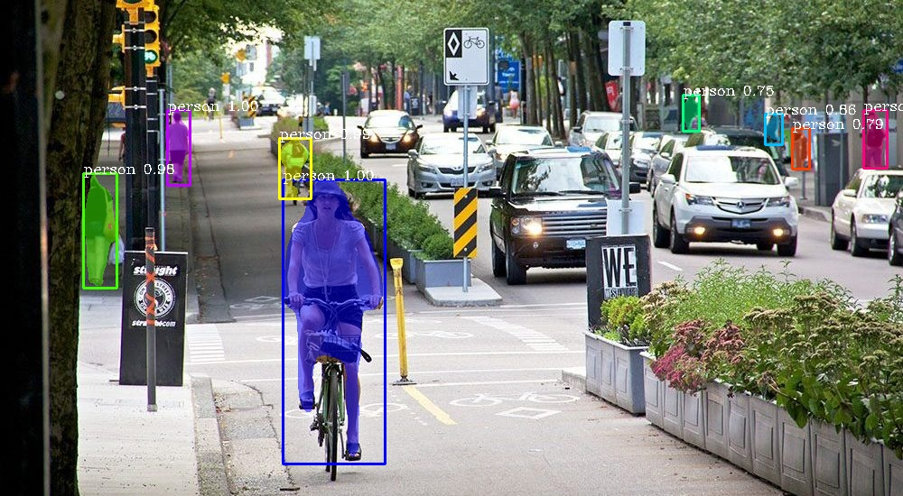
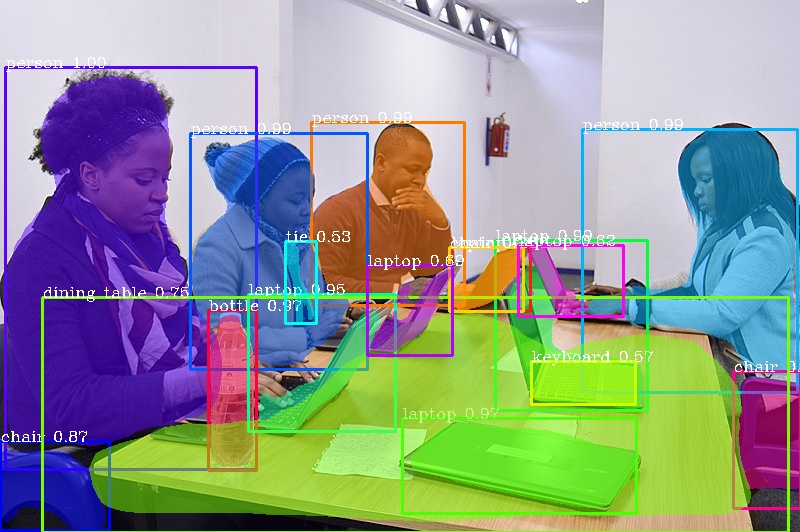
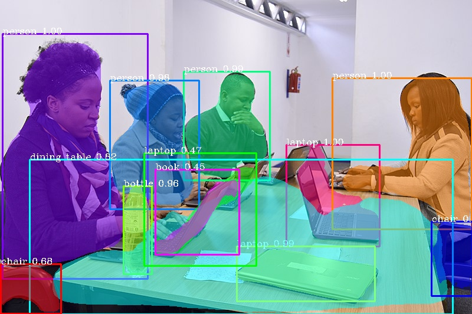
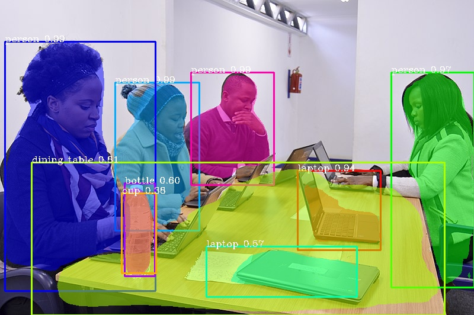

# Instance segmentation of images with PixelLib

Instance segmentation with PixelLib is based on MaskRCNN framework.

Download the mask rcnn model from [here](https://github.com/ayoolaolafenwa/PixelLib/releases/download/1.2/mask_rcnn_coco.h5)

**Code to implement instance segmentation**:

```python

  import pixellib
  from pixellib.instance import instance_segmentation

  segment_image = instance_segmentation()
  segment_image.load_model("mask_rcnn_coco.h5") 
  segment_image.segmentImage("path_to_image", output_image_name = "output_image_path")
```
**Observing each line of code:**

```python

  import pixellib
  from pixellib.instance import instance_segmentation

  segment_image = instance_segmentation()
```
The class for performing instance segmentation is imported and we created an instance of the class.

```python

  segment_image.load_model("mask_rcnn_coco.h5") 
```
This is the code to load the mask rcnn model to perform instance segmentation. 

```python

  segment_image.segmentImage("path_to_image", output_image_name = "output_image_path")
```
This is the code to perform instance segmentation on an image and it takes two parameters:

  **path_to_image**: The path to the image to be predicted by the model.

  **output_image_name**: The path to save the segmentation result. It will be saved in your current working directory.

**Sample2.jpg**


```python

  import pixellib
  from pixellib.instance import instance_segmentation

  segment_image = instance_segmentation()
  segment_image.load_model("mask_rcnn_coco.h5") 
  segment_image.segmentImage("sample2.jpg", output_image_name = "image_new.jpg")
```


This is the saved image in your current working directory. 

You can implement segmentation with bounding boxes. This can be achieved by modifying the code.

```python

  segment_image.segmentImage("sample2.jpg", output_image_name = "image_new.jpg", show_bboxes = True)

```
We added an extra parameter **show_bboxes** and set it to **True**, the segmentation masks are produced with bounding boxes.


You get a saved image with both segmentation masks and bounding boxes.

**Better Visualization of Output Segmented Images**
The default values set for visualizing segmented images are not compatible with all image resolutions. I have made it possible to regulate the parameters that determine the thickness of the bounding boxes, text size and thickness.

**sample image with default parameters**



``` python
import pixellib
from pixellib.instance import instance_segmentation

ins = instance_segmentation()
ins.load_model("mask_rcnn_coco.h5")
ins.segmentImage("sample.jpg", show_bboxes = True, output_image_name = "output.jpg", text_size=4, text_thickness=10,
box_thickness= 6)
```

**text_size**: The default text size is 0.6 and it is okay with images with low resolutions. It will be small for images with high resolutions.

**text_thickness**: The default text thickness is 0. I increased it to 4 to match the image resolution.

**box_thickness**: The default box thickness is 2 and I changed it to 10 to match the image resolution.

**Note**: **text_thickness** and **box_thickness** parameters' values must always be in integers and do not express their values in floating point numbers. But **text_size** value can be expressed in both integer and floating point numbers.

**sample image with regulated parameters**




## Extraction of Segmented Objects


PixelLib now makes it possible to extract each of the segmented objects in an image and save each of the object extracted as a separate image. This is the modified code below;

 


``` python

import pixellib
from pixellib.instance import instance_segmentation

seg = instance_segmentation()
seg.load_model("mask_rcnn_coco.h5")
seg.segmentImage("sample2.jpg", show_bboxes=True, output_image_name="output.jpg",
extract_segmented_objects= True, save_extracted_objects=True) 
```
We introduced new parameters in the *segmentImage* function which are:

**extract_segmented_objects:** This parameter handles the extraction of each of the segmented object in the image. <br>
**save_extracted_objects:** This parameter saves each of the extracted object as a separate image.Each of the object extracted in the image would be save with the name *segmented_object* with the corresponding index number such as *segmented_object_1*.  


These are the objects extracted from the image above. 

<table>
  <tr>
    <td></td>
    <td></td>
    <td></td>
  </tr>
 </table>


## Batch Segmentation of Images
PixelLib makes it possible to perform prediction on multiple images at once. 

**Code for Batch Prediction**
``` python
import pixellib
from pixellib.instance import instance_segmentation

ins = instance_segmentation()
ins.load_model("mask_rcnn_coco.h5")
ins.segmentBatch("input_folder",  show_bboxes=True, output_folder_name = "output_folder")
```

``` python
ins.segmentBatch("input_folder",  show_bboxes=True, output_folder_name = "output_folder")
```
The code for batch image prediction is very similar to the code used for a single image prediction. We replaced the single image prediction function **segmentImage** with the batch image prediction function **segmentBatch**.  The batch function takes the following parameters;

**input_folder**: this is the folder path of the input images.

**output_folder**: this is the folder path of the output segmented images. 
  **Note**: An output image in the output folder path is saved with the same name as its input image in the input folder path.

*sample folder structure*
```
--input_folder
    --test1.jpg
    --test2.jpg
    --test3.jpg

--output_folder 
    --test1.jpg
    --test2.jpg
    --test3.jpg 

```  

**Code for Extraction of Segmented Objects in Batch Prediction**

``` python
import pixellib
from pixellib.instance import instance_segmentation

ins = instance_segmentation()
ins.load_model("mask_rcnn_coco.h5")
ins.segmentBatch("input_folder", show_bboxes=True, output_folder_name = "output_folder", extract_segmented_objects=True, save_extracted_objects=True)
```
The extracted objects of each image in the input folder will be saved in a separate folder which will have the name 
**imagename_extracts** e.g if the image name is test1.jpg this means that the extracted objects will be saved in a folder named 
**test1_extracts**. 

**Note**: The folders for the extracted objects are created within the same input folder of the images.
*Sample folder structure* 
```
--input_folder
    --test1.jpg
    --test1_extracts 

    --test2.jpg
    --test2_extracts 

    --test3.jpg
    --test3_extracts

--output_folder   
    --test1.jpg
    --test2.jpg
    --test3.jpg
```

## Detection of Target Classes

The pre-trained coco model used detects 80 classes of objects. PixelLib has made it possible to filter out unused detections and detect the classes you want.

**Code to detect target classes**
``` python
 import pixellib
 from pixellib.instance import instance_segmentation

 seg = instance_segmentation()
 seg.load_model("mask_rcnn_coco.h5")
 target_classes = seg.select_target_classes(person=True)
 seg.segmentImage("sample2.jpg", segment_target_classes= target_classes, show_bboxes=True,  output_image_name="a.jpg") 
```

``` python
target_classes = seg.select_target_classes(person=True)
seg.segmentImage("sample2.jpg", segment_target_classes= target_classes, show_bboxes=True,  output_image_name="a.jpg") 
```
We introduced a new function *select_target_classes* that determines the target class to be detected. In this case we want to detect only *person* in the image. In the function *segmentImage* we added a new parameter *segment_target_classes* to filter unused detections and detect only the target class.



Beautiful Result! We were able to filter other detections and detect only the people in the image.


## Speed Adjustments for Faster Inference
PixelLib now supports the ability to adjust the speed of detection according to a user's needs. The inference speed with a minimal reduction in the accuracy of detection. There are three main parameters that control the speed of detection.

1 **average**

2 **fast**

3 **rapid**

By default the detection speed is about 1 second for a processing a single image.

 <br/> <br/>


**average detection mode**


```python

  import pixellib
  from pixellib.instance import instance_segmentation

  segment_image = instance_segmentation(infer_speed = "average" )
  segment_image.load_model("mask_rcnn_coco.h5") 
  segment_image.segmentImage("sample.jpg", show_bboxes = True, output_image_name = "new.jpg")
```
In the modified code above within the class *instance_segmentation* we introduced a new parameter **infer_speed** which determines the speed of detection and it was set to **average**. The average value reduces the detection to half of its original speed, the detection speed would become *0.5* seconds for processing a single image.

**Output Image** <br/>


 <br/> <br/>

We obtained beautiful results with *average detection speed mode*. <br/> <br/>

**fast detection  mode**
```python

  import pixellib
  from pixellib.instance import instance_segmentation

  segment_image = instance_segmentation(infer_speed = "fast" )
  segment_image.load_model("mask_rcnn_coco.h5") 
  segment_image.segmentImage("sample.jpg", show_bboxes = True, output_image_name = "new.jpg")
```
In the code above we replaced the **infer_speed**  value to **fast** and the speed of detection is about *0.35* seconds for processing a single image. <br/>

**Output Image** <br/>


 <br/> <br/>

Our results are still wonderful with *fast detection speed mode*. <br/> <br/>


**rapid detection mode**
```python

  import pixellib
  from pixellib.instance import instance_segmentation

  segment_image = instance_segmentation(infer_speed = "rapid" )
  segment_image.load_model("mask_rcnn_coco.h5") 
  segment_image.segmentImage("sample.jpg", show_bboxes = True, output_image_name = "new.jpg")
```
In the code above we replaced the **infer_speed**  value to **rapid** which is the fastest detection mode. The speed of detection  becomes 
*0.25* seconds for processing a single image. <br/>


**Output Image** <br/>


 <br/> <br/>

The *rapid detection speed mode* produces good results with the fastest inference speed. <br/> <br/>

**Note** These inference reports are obtained using Nvidia GeForce 1650. <br/> <br/>

**Specialised uses of PixelLib may require you to return the array of the segmentation's output.**

**Obtain the following arrays**:

-Detected Objects' arrays

-Objects' corresponding class_ids' arrays

-Segmentation masks' arrays

-Output's array

By using this code

``` python

  segmask, output = segment_image.segmentImage()

```


* You can test the code for obtaining arrays and print out the shape of the output by modifying the instance segmentation code below.

``` python

  import pixellib
  from pixellib.instance import instance_segmentation
  import cv2

  instance_seg = instance_segmentation()
  instance_seg.load_model("mask_rcnn_coco.h5")
  segmask, output = instance_seg.segmentImage("sample2.jpg")
  cv2.imwrite("img.jpg", output)
  print(output.shape)
```

Obtain arrays of segmentation with bounding boxes by including the parameter **show_bboxes**.

```python

  segmask, output = segment_image.segmentImage(show_bboxes = True)

```


* Full code

```python

  import pixellib
  from pixellib.instance import instance_segmentation
  import cv2

  instance_seg = instance_segmentation()
  instance_seg.load_model("mask_rcnn_coco.h5")
  segmask, output = instance_seg.segmentImage("sample2.jpg", show_bboxes= True)
  cv2.imwrite("img.jpg", output)
  print(output.shape)

``` 

**Note:**
Access mask's values  using **segmask['masks']**, bounding box coordinates using **segmask['rois']**, class ids using 
**segmask['class_ids']**.  

``` python
segmask, output = segment_image.segmentImage(show_bboxes = True, extract_segmented_objects= True )
```
Access the value of the extracted and croped segmented object using **segmask['extracted_objects']**


# Process opencv's frames 

```python

  import pixellib
  from pixellib.instance import instance_segmentation
  import cv2

  segment_frame = instance_segmentation()
  segment_frame.load_model("mask_rcnn_coco.h5")

  capture = cv2.VideoCapture(0)
  while True:
    ret, frame = capture.read()
    segment_frame.segmentFrame(frame)
    cv2.imshow("frame", frame)
    if  cv2.waitKey(25) & 0xff == ord('q'):
        break
```    
